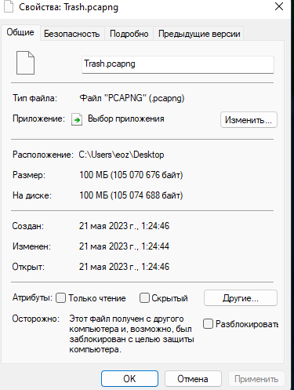

# Сбор и аналитическая обработка информации о сетевом трафике
## Цель работы
1.Развить практические навыки использования современного стека
инструментов сбора и аналитической обработки информации о сетвом трафике
2.Освоить базовые подходы блокировки нежелательного сетевого трафика
3.Закрепить знания о современных сетевых протоколах прикладного уровня
## Ход выполнения практической работы
1.C помощью Wireshark был собран сетевой трафик объёмом 100 Мб:


2.C помощью утилиты Zeek была выделена метаинформация сетевого трафика
(файлы http.log и dns.log в репозитории)
3.Загрузим и соединим файлы, содержащие списки источников нежелательного
трафика:
```
mkdir hosts
wget -q https://github.com/StevenBlack/hosts/raw/master/data/add.2o7Net/hosts -O hosts/hosts.1
wget -q https://raw.githubusercontent.com/StevenBlack/hosts/master/data/KADhosts/hosts -O hosts/hosts.2
wget -q https://raw.githubusercontent.com/StevenBlack/hosts/master/data/yoyo.org/hosts -O hosts/hosts.3
wget -q https://raw.githubusercontent.com/StevenBlack/hosts/master/data/tiuxo/hosts -O hosts/hosts.4
wget -q https://raw.githubusercontent.com/StevenBlack/hosts/master/data/URLHaus/hosts -O hosts/hosts.5
wget -q https://raw.githubusercontent.com/StevenBlack/hosts/master/data/mvps.org/hosts -O hosts/hosts.6
sort hosts/hosts* | grep -Eo '^([^\\"'\''#]|\\.|"([^\\"]|\\.)*"|'\''[^'\'']*'\'')*' | uniq > 123.csv
rm -rf hosts
```
В результате был получен файл 123.csv
4.Объединив два полученных датафрейма, получим итоговое количество
нежелательного трафика:
Высчитываем процент нежелательного трафика с помощью программы на Python
```
data = open(r"T:\.temp\123.csv",'r',encoding="utf-8").read()
print("DNS имен из трафика: "+str(data.count('CNAME'))+"; % нежелательного трафика - "+str(round(data.count('CNAME')*100/data.count(',"DNS",'),3)))
``` 
## Оценка результата
В результате лабораторной работы мы смогли определить нежелательный
трафик.
## Вывод
Таким образом, мы научились анализировать сетевой трафик и, используя
современный стек инструментов, был освоен подход блокировки
нежелательного сетевого трафика на основе чёрного списка.
