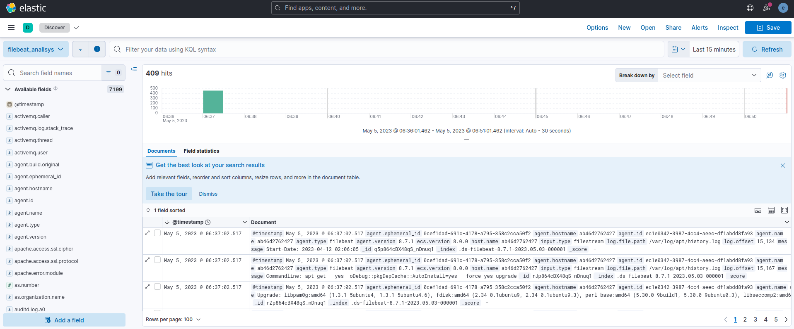
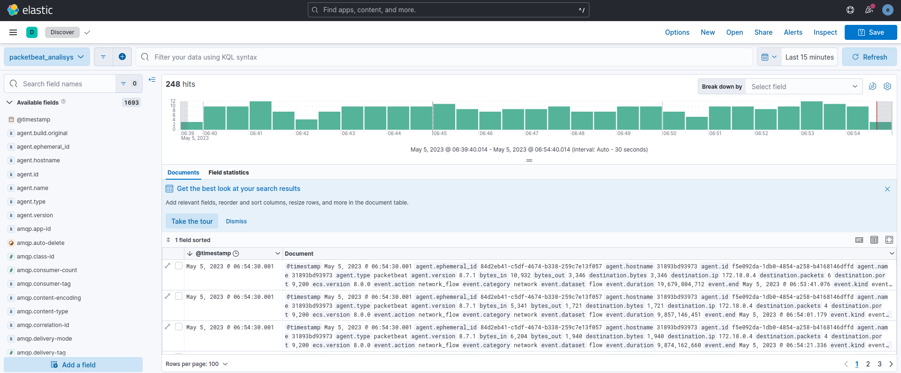

# Развертывание системы мониторинга ELK Stack

## Цель работы

1. Освоить базовые подходы централизованного сбора и накопления информации

2. Освоить современные инструменты развертывания контейнирозованных приложений

3. Закрепить знания о современных сетевых протоколах прикладного уровня

## Ход выполнения практической работы

### Задание 1. Развернуть систему мониторинга на базе ElasticSearch

1. Настройка

    Для работы ElasticSearch требуется увеличить размер виртуальной памяти системы:

```
┌──(root㉿kali)-[/home/kali]
└─# sysctl -w vm.max_map_count=262144
vm.max_map_count = 262144
```

Далее следуем инструкции по ссылке:

https://www.elastic.co/guide/en/elasticsearch/reference/current/docker.html

2. После формирования файлов с конфигурациями, нужно запустить образы командой

```
┌──(root㉿kali)-[/home/kali/Desktop/dockerr]
└─# docker-compose up -d          
Starting packetbeat ... 
nginx is up-to-date
dockerr_setup_1 is up-to-date
Starting filebeat   ... 
dockerr_es01_1 is up-to-date
dockerr_es02_1 is up-to-date
Starting packetbeat ... done
Starting filebeat   ... done
```

3. Переходим на `localhost:5061` и авторизируемся


4. Проверям, что установленны все средства для сбора информации из файлов журналов и сбора аналитики трафика


5. Создаем новый data view для filebeat



6. Создаем новый data view для packetbeat



## Оценка результата

Была развёрнута система ElasticSearch и настроена система сбора трафика и лог-файлов.

## Вывод

В результате работы была освоена система контейнеризации приложений Docker, работа с Docker-compose и освоена система централизованного сбора и накопления информации ElasticSearch.
